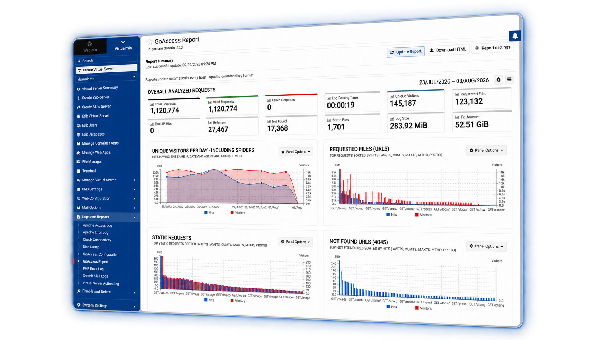

# virtualmin-goaccess

A Virtualmin plugin that builds interactive [GoAccess](https://goaccess.io/)
reports for Apache and Nginx websites.

<p align="center">
  <picture>
    <source media="(prefers-color-scheme: dark)" srcset="docs/images/hero-dark.png">
    
  </picture>
</p>

## Requirements

- Webmin 2.670 or later with Virtualmin 8.2 or later
- GoAccess 1.7 or later

## Usage

Enable **GoAccess reporting** in **System Settings → Features and Plugins**, then
enable it for a virtual server. Open the report under
**Logs and Reports → GoAccess Report**. Reports update on a schedule or on demand.
Use **GoAccess Configuration** to set the log format, schedule and filters.

To enable reporting for a virtual server from the command line, run as root:

```sh
virtualmin enable-feature --domain example.com --virtualmin-goaccess
```

## Tests

```sh
prove t/report.t
node t/report-sync.js
```

## License

GPL-3.0; see [LICENSE](LICENSE).
